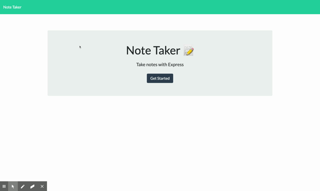

# Fundamentally Organized

## Description
An simple, intuitive note-taking app for helping you stay organized.  No fluff, no wild features - just the basics and sometimes, that's all you need.  

## Technologies
* HTML
* CSS
* [Bootstrap](https://getbootstrap.com/)
* JavaScript
* Node.js
* [Express](https://expressjs.com/)
* [Nodemon](https://www.npmjs.com/package/nodemon)
* [uuid](https://www.npmjs.com/package/uuid)

## Installation
To install the necessary dependencies to run this application on your local machine:

``` bash
npm --i
```
## Usage
Here's a quick look at what this app can do:  



## Credits
* I referred to my notes from [Traversy Media's Express.js crash course](https://www.youtube.com/watch?v=L72fhGm1tfE).  Super great crash course, by the way.
* When trying to determine the disconnect with my db.json file and the fs module, I came across [this helpful Stack overflow discussion](https://stackoverflow.com/questions/36093042/how-do-i-add-to-an-existing-json-file-in-node-js).  (p.s. i was missing an essential step of parsing the json data.)

## License
Copyright &copy; Licensed under the MIT license.

## Questions
Contact me at emilyblair96@gmail.com with questions.